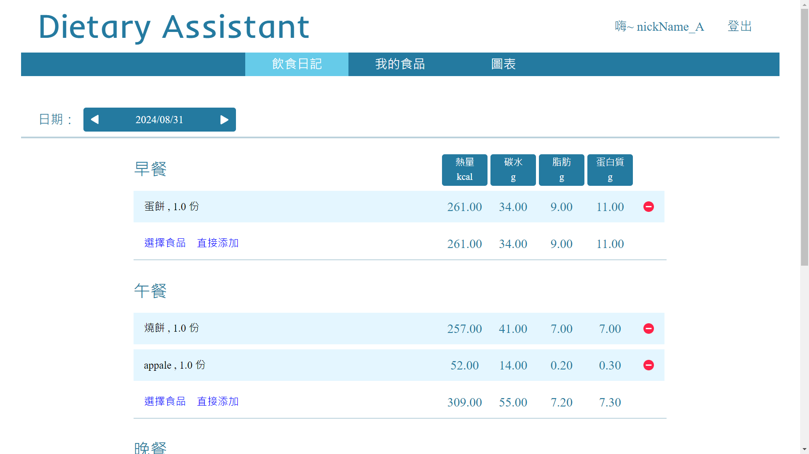
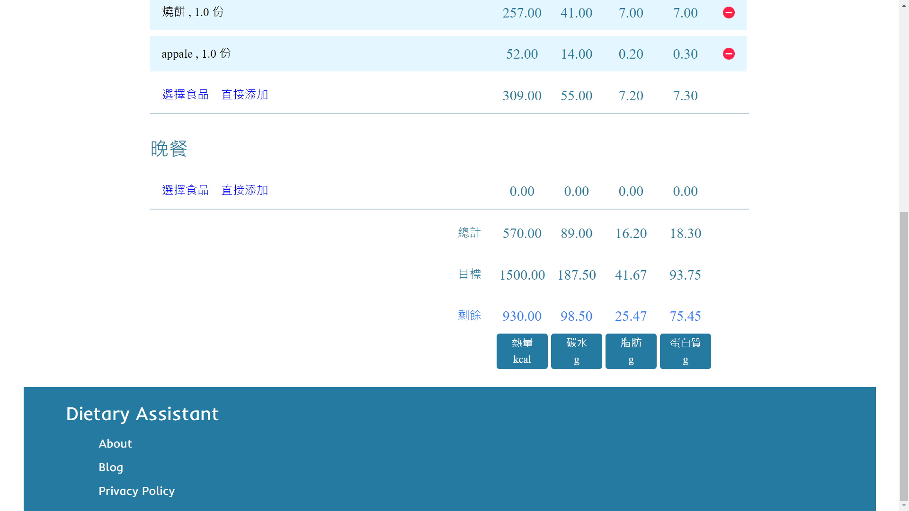
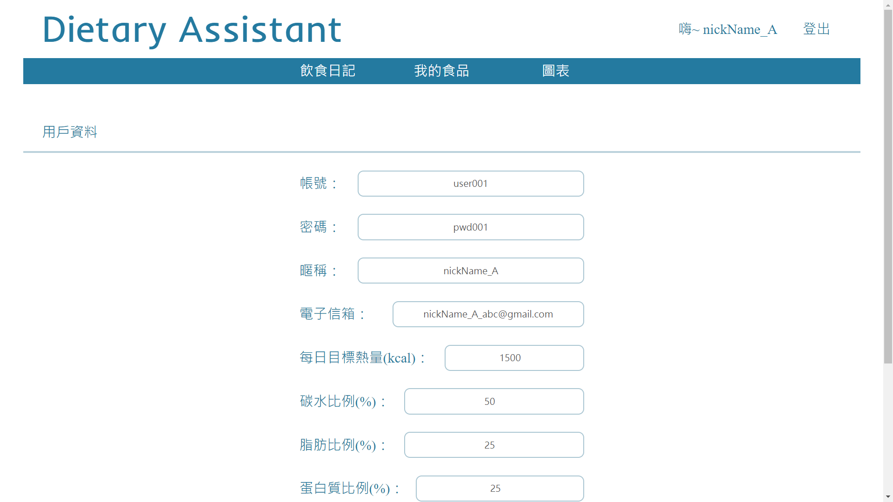
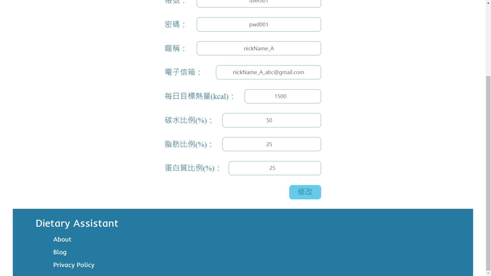
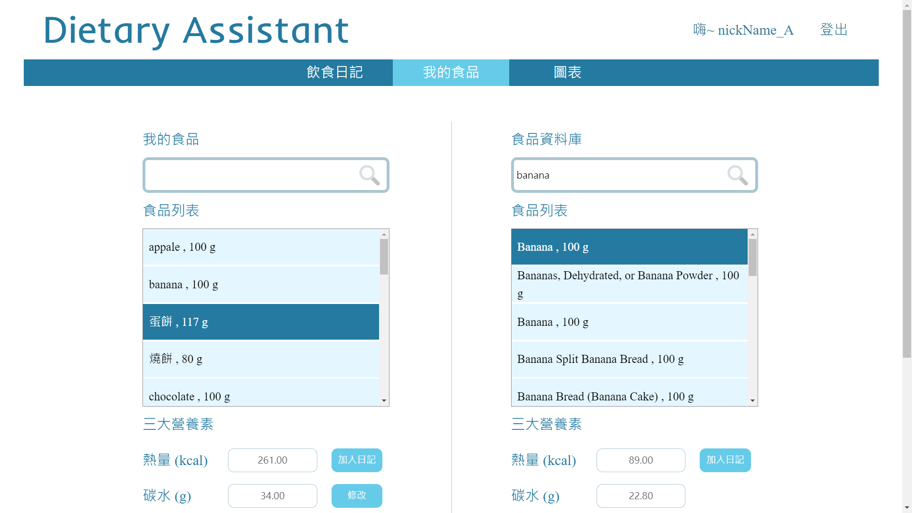
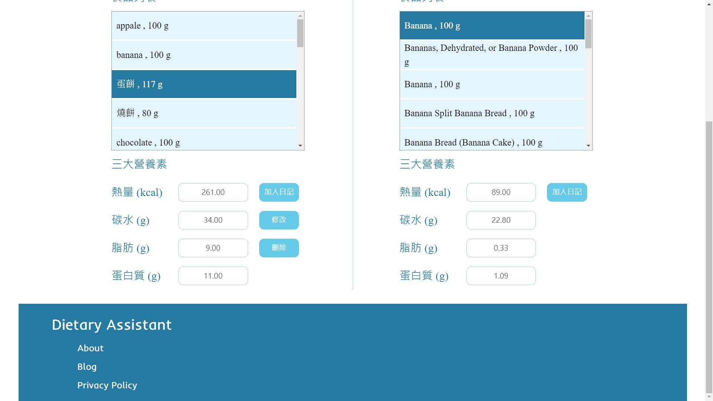
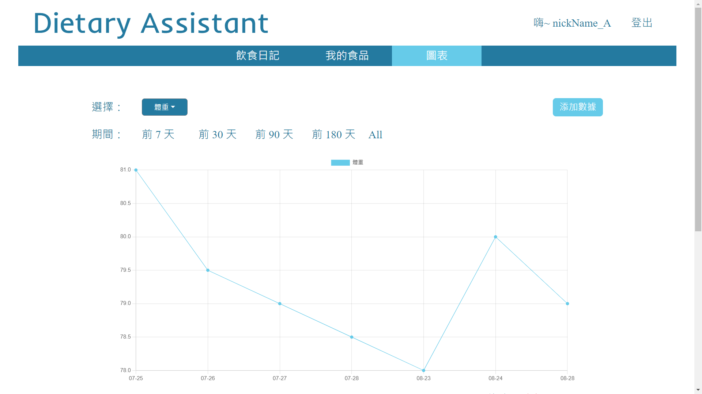
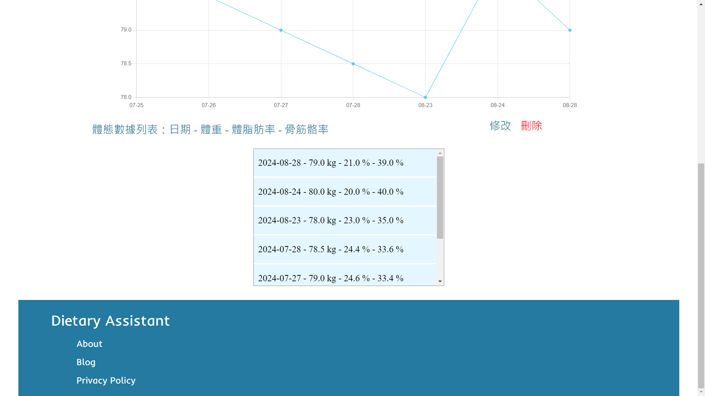

# 飲食助理 ( Dietary assistant )

  

[關於](#關於)

[頁面與功能](#頁面與功能)

[系統設計](#系統設計)

[數據庫設計](#數據庫設計)

[Web API 設計](#web-api-設計)

[用到的技術](#用到的技術)

---

# 關於

飲食助理 ( Dietary assistant ) 是一個協助使用者記錄飲食、追蹤熱量與控制飲食習慣的工具網站，使用者可以紀錄每日所攝取的食物，系統會自動計算其總熱量與三大營養素，並允許使用者設定每日熱量目標及營養素比例，以達到控制飲食的效果。

系統整合了第三方資料庫 Edamam API，讓使用者能快速搜尋各種食物並獲取其營養資訊，同時也支援手動輸入自訂食物。除了飲食紀錄外，系統還提供體重、體脂肪率等數據的追蹤功能，並透過圖表視覺化呈現，協助使用者清楚掌握自身的變化趨勢。

主要使用以下技術：

- Spring：透過 IoC/DI 管理專案中的 Service、DAO 等元件，降低模組耦合度，提升系統的可維護性。
- Spring MVC：開發 RESTful API 處理用戶登入、註冊與頁面導向等功能請求。
- MyBatis：透過 Mapper 介面簡化 MySQL 的 CRUD 操作。
- MySQL：用於保存系統業務數據，並根據 ER 模型圖創建數據表，確保結構清晰，方便維護與查詢。
- Vue：作為前端框架，用於接收後端傳遞的系統數據並進行動態頁面渲染，將結果呈現給使用者，實現前後端分離的開發模式。
- 第三方API整合：串接 Edamam API 提供食品搜尋與營養成分查詢功能。

GitHub：[dietary_assistant](https://github.com/LYH-94/dietary_assistant)

UI 設計：[Dietary assistant](https://www.figma.com/design/4CqveKgOGsFqqdwKX4nwHa/Dietary-assistant?node-id=0-1&node-type=canvas)

Demo - http://linyaohua.ddns.net:8080/dietary_assistant/

測試帳號
* 一般用戶 - 帳：user001 密：pwd001

# 頁面與功能

- 用戶登入頁
    - 點擊 “Dietary Assistant” 文字，訪問 “飲食日記頁”。
    - 點擊 “登入” 按鈕，可透過帳號、密碼來登入用戶。
    - 點擊 “註冊” 按鈕，訪問 “用戶註冊頁”。

  

- 用戶註冊頁
    - 點擊 “Dietary Assistant” 文字，訪問 “飲食日記頁”。
    - 點擊 “確認” 按鈕，根據帳號、密碼、暱稱和電子信箱來註冊用戶帳號。

  

- 飲食日記頁
  - 點擊 “Dietary Assistant” 文字，訪問 “飲食日記頁”。
  - 點擊 “用戶名稱” 文字，訪問 “用戶資料頁”。
  - 點擊 “登出” 文字，退出用戶帳號，並重新訪問 “用戶登入頁”。
  - 導覽列
    - 點擊 “飲食日記” 訪問 “飲食日記頁”。
    - 點擊 “我的食品” 訪問 “我的食品頁”。
    - 點擊 “圖表” 訪問 “圖表頁”。
  - 紀錄用戶每日的三餐。
    - 使用日期選擇器來選擇不同日期的飲食日記。
    - 紀錄每一筆餐點的熱量、碳水、脂肪、蛋白質和份量。
    - 計算卡路里
      - 自動計算所攝取的卡路里，並根據指定的每日目標熱量計算出還有多少卡路里能攝取。
    - 點擊 “選擇食品” 文字，訪問 “我的食品頁”。
    - 點擊 ”直接添加” 文字，新增食品至飲食日記。
    - 點擊 “刪除” 圖示，可刪除指定的食品。

  

  

- 用戶資料頁
  - 點擊 “Dietary Assistant” 文字，訪問 “飲食日記頁”。
  - 點擊 “用戶名稱” 文字，訪問 “用戶資料頁”。
  - 點擊 “登出” 文字，退出用戶帳號，並重新訪問 “用戶登入頁”。
  - 導覽列
    - 點擊 “飲食日記” 訪問 “飲食日記頁”。
    - 點擊 “我的食品” 訪問 “我的食品頁”。
    - 點擊 “圖表” 訪問 “圖表頁”。
  - 展示用戶個人資料。
    - 點擊 “修改” 按鈕，可以修改用戶資料，設定每日目標熱量，以及其中的碳水、脂肪和蛋白質的比例。

  

  

- 我的食品頁
  - 點擊 “Dietary Assistant” 文字，訪問 “飲食日記頁”。
  - 點擊 “用戶名稱” 文字，訪問 “用戶資料頁”。
  - 點擊 “登出” 文字，退出用戶帳號，並重新訪問 “用戶登入頁”。
  - 導覽列
    - 點擊 “飲食日記” 訪問 “飲食日記頁”。
    - 點擊 “我的食品” 訪問 “我的食品頁”。
    - 點擊 “圖表” 訪問 “圖表頁”。
  - 可以檢視用戶輸入過的所有餐點。
    - 可以透過 “搜尋” 功能來尋找餐點。
    - 點擊 “加入日記” 按鈕，將顯示輸入提示，設定三餐及份數。
    - 點擊 “修改” 按鈕，將顯示被選擇的餐點資訊，即可修改餐點。
    - 點擊 “刪除” 按鈕：將刪除被選擇的餐點。
  - 左邊 “我的食品” 即用戶新增過的所有餐點。
  - 右邊 “食品資料庫” 即第三方資料庫 ( Edamam API ) 的搜尋結果。

  

  

- 圖表頁
  - 點擊 “Dietary Assistant” 文字，訪問 “飲食日記頁”。
  - 點擊 “用戶名稱” 文字，訪問 “用戶資料頁”。
  - 點擊 “登出” 文字，退出用戶帳號，並重新訪問 “用戶登入頁”。
  - 導覽列
    - 點擊 “飲食日記” 訪問 “飲食日記頁”。
    - 點擊 “我的食品” 訪問 “我的食品頁”。
    - 點擊 “圖表” 訪問 “圖表頁”。
  - 用戶體態數據可視化。
  - 用戶體態數據列表
    - 點擊 “添加數據” 按鈕，新增用戶的體態數據。
    - 點擊 “刪除” 文字，刪除指定數據。
    - 點擊 “修改” 文字，更新指定數據。
  - 使用下拉式選單 ( 體重、體脂肪、骨筋骼率 ) 選擇要顯示的數據。
  - 點擊 “期間” 來選擇要檢視的部分數據。

  

  

# 系統設計

- 單體架構
- SSM 框架組合
- MVC 分層設計
- 前後端分離開發

  

# 數據庫設計

1. 抽取實體 ( 應與數據表對應 ) 並分析其中的屬性  
   用戶 User、用戶資訊 UserInfo、飲食日記 DietDiary、食品 Food、體態數據 BodyCompositionData
   - 用戶 User：帳號、密碼
   - 用戶資訊 UserInfo：所屬用戶、暱稱、電子信箱、目標熱量、碳水比例、脂肪比例、蛋白質比例。
   - 飲食日記 DietDiary：所屬用戶、日期、食品、份量、三餐。
   - 食品 Food：所屬用戶、食品名稱、熱量、碳水、脂肪、蛋白質、份量。
   - 體態數據 BodyCompositionData：所屬用戶、日期、體重、體脂肪率、骨筋骼率。
2. 分析實體之間的關係
   - 用戶 User：用戶資訊 UserInfo ⇒ 1：1
   - 用戶 User：飲食日記 DietDiary ⇒ 1：n
   - 用戶 User：食品 Food ⇒ 1：n
   - 用戶 User：體態數據 BodyCompositionData ⇒ 1：n
   - 飲食日記 DietDiary：食品 Food ⇒ 1：1

  

# Web API 設計

根據 Open API 規範撰寫的 Web API：[openapi.yaml](https://github.com/LYH-94/dietary_assistant/blob/main/docs/openapi.yaml)

根據頁面設計與功能需求，抽取出所有需要通過 Web API 實現的功能，如下：

- 用戶登入頁 login.html ⇒ GET - /page/login.html
  - 點擊 “Dietary Assistant” 文字，訪問 “index.html”。
  - 點擊 “登入” 按鈕，可透過帳號、密碼來登入用戶。 ⇒ POST - /login
  - 點擊 “註冊” 按鈕，訪問 “用戶註冊頁 signup.html”。

- 用戶註冊頁 signup.html ⇒ GET - /page/signup.html
  - 點擊 “Dietary Assistant” 文字，訪問 “index.html”。
  - 點擊 “確認” 按鈕，根據帳號、密碼、暱稱和電子信箱來註冊用戶帳號。 ⇒ POST - /signup

- index.html ⇒ GET - /page/index.html ⇒ GET - /index
  - 點擊 “Dietary Assistant” 文字，訪問 “index.html”
  - 點擊 “用戶名稱” 文字，訪問 “用戶資料頁 userInfo.html”。
  - 點擊 “登出” 文字，退出用戶帳號，並響應 “用戶登入頁 login.html”。 ⇒ POST - /logout
  - 導覽列
    - 點擊 “飲食日記” 訪問 “飲食日記頁 dietDiary.html”。
    - 點擊 “我的食品” 訪問 “我的食品頁 myFood.html”。
    - 點擊 “圖表” 訪問 “圖表頁 myChart.html”。

  - 用戶資料頁 userInfo.html ⇒ GET - /page/userInfo.html ⇒ GET - /userInfo
    - 點擊 “修改” 按鈕，可以修改用戶資料，設定每日目標卡路里，以及其中的碳水、脂肪和蛋白質的比例。 ⇒ PUT - /userInfo

  - 飲食日記頁 dietDiary.html ⇒ GET - /page/dietDiary.html ⇒ GET - /dietDiary/{date}
    - 使用日期選擇器來選擇不同日期的飲食日記。 ⇒ GET - /dietDiary/{date}
    - 點擊 “選擇食品” 文字，訪問 “我的食品頁 myFood.html”。
    - 點擊 ”直接添加” 文字，將顯示輸入提示，確認送出後添加至飲食日記。 ⇒ POST /myFood
    - 點擊 “刪除” 圖示，可刪除指定的飲食紀錄。⇒ DELETE - /dietDiary/{id}/{date}

  - 我的食品頁 myFood.html ⇒ GET - /page/myFood.html ⇒ GET - /myFood
    - 我的食品
      - 點擊 “加入日記” 按鈕，將顯示輸入提示，設定三餐及份數，確認送出後添加至飲食日記。 ⇒ POST - /myFood
      - 點擊 “修改” 按鈕，修改指定的食品。 ⇒ PUT - /myFood
      - 點擊 “刪除” 按鈕，刪除指定的食品。 ⇒ DELETE - /myFood/{id}
    - 食品資料庫
      - 點擊 “加入日記” 按鈕，將顯示輸入提示，設定三餐及份數。 ⇒ POST - /myFood
      - 可以透過 “搜尋” 功能，從第三方資料庫 ( Edamam API ) 中尋找餐點。⇒ GET - /Edamam/{foodName}

  - 圖表頁 myChart.html ⇒ GET - /page/myChart.html ⇒ GET - /myChart
    - 點擊 “添加數據” 按鈕，新增用戶的體態數據。 ⇒ POST - /myChart
    - 點擊 “刪除” 圖示，刪除指定數據。 ⇒ DELETE - /myChart/{id}

# 用到的技術

### 前端

- HTML5 / CSS / JavaScript ( 異步請求使用 Fetch API )
- Bootstrap ( v5.3.3 )
  - Bootstrap-datepicker ( v1.9.0 )
    - JQuery ( v3.5.1 )
- Vue3 ( v3.4.34 )
- Chart.js ( v4.4.1 )

### 後端

- Web container - Tomcat ( v8.5.81 )
- Maven ( v3.8.4 )
- Servlet ( v3.1.0 )
- Spring ( v5.3.1 )
- Spring MVC ( v5.3.1 )
- 處理 Transaction
  - Spring JDBC ( v5.3.1 )

    需要 spring JDBC 中的 DataSourceTransactionManager 類。

  - Spring AOP ( v5.3.1 )

    聲明式事務管理是透過 Spring AOP 來實現的。

- MyBatis ( v3.5.7 )
  - MyBatis-Spring ( v2.0.6 )
  - MyBatis 逆向工程插件 ( v1.3.0 )
    - 插件依賴
      - mybatis-generator-core ( v1.3.2 )
      - MySQL 驅動 - mysql-connector-j ( v8.0.31 )
- Jackson ( v2.12.1 )
- Spring Test ( v5.3.1 )
  - Junit4 ( v4.12 )

### 數據庫

- 關係型數據庫 - MySQL ( v8.0.31 )
- 數據庫連接池 - Druid ( v1.2.14 )
- MySQL 驅動 - mysql-connector-j ( v8.0.31 )
